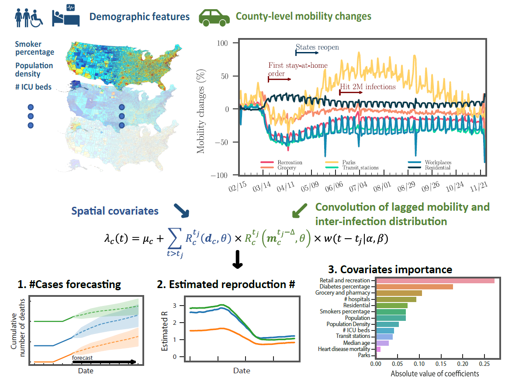

# Hawkes process modeling of COVID-19 with mobility leading indicators and spatial covariates
## Overall Framework

## Dependencies 
Matlab 2018b

## Quick run
### Use MLE estimate shape and scale parameters for Weibull distribution
#### HawkPR('./input_data/NYT_Dconfirmed.csv', './input_data/GoogleMobi_Dconfirmed.csv', './input_data/Demo_Dconfirmed.csv', 14, '', '', 200, 7, 100, './output/mdl.mat', './output/pred.csv')
### Specify shape and scale parameters for Weibull distribution
#### HawkPR('./input_data/NYT_Dconfirmed.csv', './input_data/GoogleMobi_Dconfirmed.csv', './input_data/Demo_Dconfirmed.csv', 14, 8, 4, 200, 7, 100, './output/mdl.mat', './output/pred.csv')

## Function input
### HawkPR( InputPath_report, InputPath_mobility, InputPath_demography, Delta, Alpha, Beta, EMitr, DaysPred, SimTimes, OutputPath_mdl, OutputPath_pred
InputPath_report: Input path for COVID daily report.  
InputPath_mobility: Input path for mobiblity report.  
InputPath_demography: Input path for spatial demographic features.  
Delta: Days lagged for mobility.  
Alpha: Shape parameters for Weibull distribution. Leave it blank string as '' to allow MSE estimation.  
Beta: Scale parameters for Weibull distribution. Leave it blank string as '' to allow MSE estimation.  
EMitr: Maximum iterations for EM algorithm.  
DaysPred: Number of days to make prediction.  
SimTimes: Simulation times for Hawkes processes. Nota that the prediction is the average of number of simulated events among all simulations.  
OutputPath_mdl: Output path for the trained model.  
OutputPath_pred: Output path for prediction results.  

